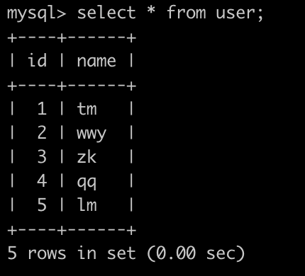
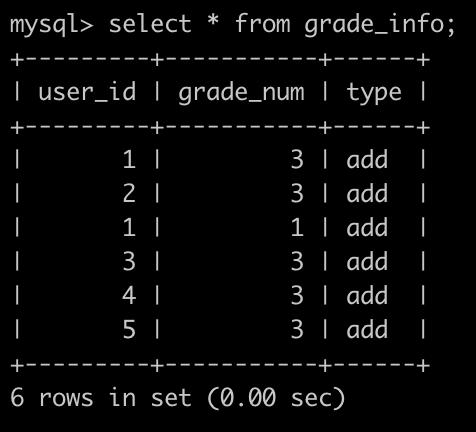
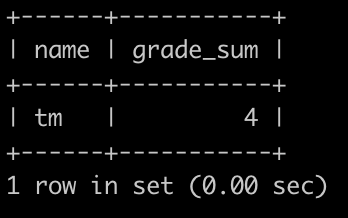

### 技术面试1
#### 技术问题
镜像下发流程  
裸机删除格式化过程
大磁盘如何提高格式化效率，缩短时间，可以考虑证书加密，证书替换之后，数据不可读。  
介绍自己的优势  
#### 编程题目
##### 题目1
并发

```
#include <stdint.h>
#include <stdlib.h>
#include <stdio.h>

* @param store 存储结构，void *指针，类型不限
* @param key int64_t，取值范围是int64_t, 在取值范围内是均匀分布, 数量大约是4M个
* @param value int64_t
* @return 如果key不存在于store中,那么存储key,value对到store中,并返回0; 如果key存在,那么判断传入的value和store中的value是否相等,相等返回1,不等返回2

int32_t foo(void *store, int64_t key, int64_t value);

// 例如有如下顺序调用
int main(int argc, char **argv) {
void* store;
// 初始化store
printf("foo(store,0,1)=%d\n", foo(store, 0, 1));  // 0
printf("foo(store,1,1)=%d\n", foo(store, 1, 1));  // 0
printf("foo(store,1,1)=%d\n", foo(store, 1, 1));  // 1
printf("foo(store,1,2)=%d\n", foo(store, 1, 2));  // 2
printf("foo(store,1,1)=%d\n", foo(store, 1, 1));  // 1
}

```
1. 实现foo函数和相关测试用例，语言自选，根据语言调整函数的定义，要求可以直接运行。
2. 保证并发场景函数的正确性。


### 技术面试2
#### 技术相关
数据中心 配额管理、分配策略。  
数据仓库，并行数据库   
存储网络卸载，SOC  
裸金属存储spdk    
K8S  helm charts  
GPU调度是否考虑拓扑  
linux内核：Linux如何实现+1，-1等的原子操作  寄存器相关


##### 题目1
合并区间
限定语言：Kotlin、Typescript、Python、C++、Groovy、Rust、Java、Go、C、Scala、Javascript、Ruby、Swift、Php、Python 3
给出一组区间，请合并所有重叠的区间。
请保证合并后的区间按区间起点升序排列。

示例1
输入

```[[10,30],[20,60],[80,100],[150,180]]```

输出

```[[10,60],[80,100],[150,180]]```

##### 题目2
获得积分最多的人(一)   
限定语言：Sqlite、Mysql  
牛客每天有很多用户刷题，发帖，点赞，点踩等等，这些都会记录相应的积分。  
有一个用户表(user)，简况如下：  
  
还有一个积分表(grade_info)，简况如下:  
  
第1行表示，user_id为1的用户积分增加了3分。  
第2行表示，user_id为2的用户积分增加了3分。  
第3行表示，user_id为1的用户积分又增加了‘、  ·1


分。  
.......  
最后1行表示，user_id为5的用户积分增加了3分。  

请你写一个SQL查找积分增加最高的用户的名字，以及他的总积分是多少(此题数据保证积分最高的用户有且只有1个)，以上例子查询结果如下:  
  
解释:  
user_id为1的总计加了4分，其他的都是3分，user_id为1的name为tm  
输出tm|4  
示例1  
输入  
```sql
drop table if exists user;
drop table if exists grade_info;

CREATE TABLE user (
id  int(4) NOT NULL,
name varchar(32) NOT NULL
);

CREATE TABLE grade_info (
user_id  int(4) NOT NULL,
grade_num int(4) NOT NULL,
type varchar(32) NOT NULL
);

INSERT INTO user VALUES
(1,'tm'),
(2,'wwy'),
(3,'zk'),
(4,'qq'),
(5,'lm');

INSERT INTO grade_info VALUES
(1,3,'add'),
(2,3,'add'),
(1,1,'add'),
(3,3,'add'),
(4,3,'add'),
(5,3,'add');
```
输出
```
tm|4
```